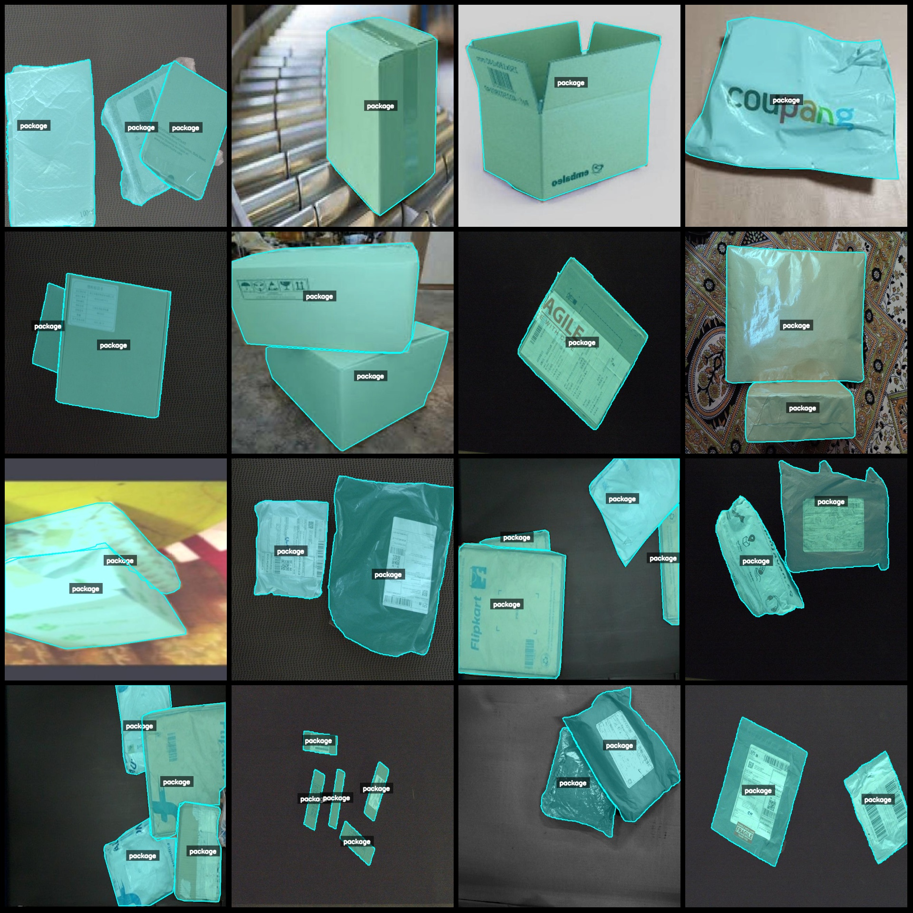
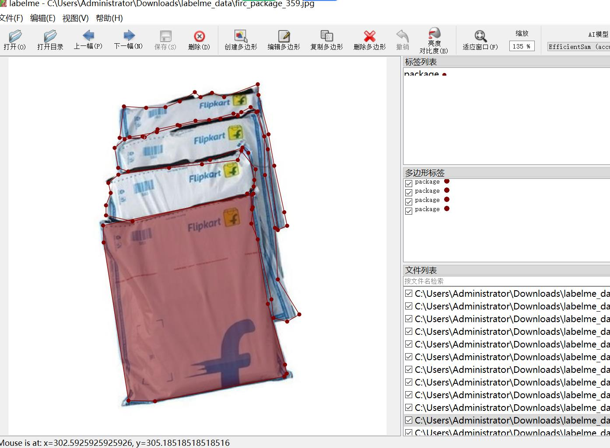

# Parcel Packet Identification and Segmentation Data Set - LabelMe Format: 1703 Images, 1 Category

Please note that over half of the images in the dataset are enhanced pictures (i.e., you see them as duplicates). Please refer to the image preview for details.
The dataset format is labelme format, without mask files, only containing jpg images and corresponding json files.
number of images: 1703  
The number of annotated quantities (number of json files) is: 1703.
```
{
  "categories": [
    {
      "name": "YOLO",
      "description": "You Only Look Once"
    },
    {
      "name": "VOC",
      "description": "Vision Challenges in Context"
    },
    {
      "name": "COCO",
      "description": "Common Objects in Context"
    },
    {
      "name": "JSON",
      "description": "JavaScript Object Notation"
    },
    {
      "name": "XML",
      "description": "eXtensible Markup Language"
    },
    {
      "name": "Python",
      "description": "High-level programming language"
    }
  ]
}
```
annotation class names:["package"]  
The number of boxes annotated in each category:
package count = 3894  
Total number of frames: 3894
Use the labelme tool: annotation=5.5.0
Image resolution: 640x640
Annotation rules: Draw polygons for categories.
Special note: You can open the dataset in labelme for editing. For JSON datasets, you need to convert them into mask or yolo format or coco format for semantic segmentation or instance segmentation.
Special declaration: This dataset does not guarantee the accuracy of the trained model or weight files.
Preview image:
Example: 

```
```
```
Random selected 16 images:
Labeling the Drawing Results:
## Images





Here is a pay link on Stripe ( https://buy.stripe.com/3cs8yP7sY87d0vu9AB ). Please contact me lonlonago@foxmail.com after funding $89, and I will send you a complete data files , thank you!

